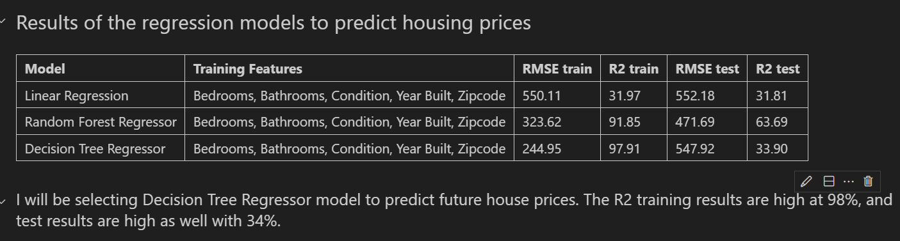
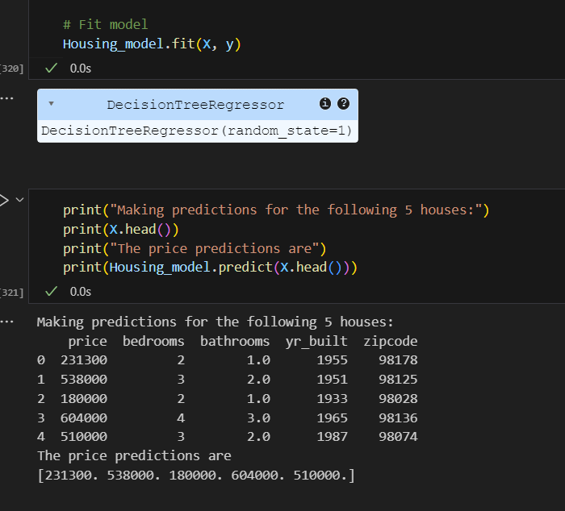

Project: Housing Price Projection Project
Author:  Inga Miller
Date: November, 2024
Email: S566319@nwmissouri.edu
Institution: Northwest Missouri State University, Maryville MO 64468, USA

Description: The project's domain is real estate.  It was chosen due to the high interest in the real estate pricing projection for investment possibilities. The data problem is the ability to predict if the market with go up or down, in turn will investors lose or gain the capital invested.

Keywords
Data Analytics
Data Visualization

Table of Contents
Introduction
Goals of this Research
Data Overview and Collection
Data Descriptive Statistics
Data Types
Data Sources
Data Dictionary
Data Processing and Cleaning
Exploratory Data Analysis
Data Visualization
Data Trends
Model Training, Selection, and Evaluation
Results
Conclusion
Limitations of project
Ideas for future work
References

Introduction
Real estate pricing projection has been a topic for investment possibilities. This project analyzes housing data in Washington state from May of 2014 to May of 2015.

Data Overview 
The data set used for this research comes from Kaggle, and includes values from May of 2014 to May of 2015, and lists property details such as price, number of bedrooms and bathrooms, the year it was built, the zip code of the property location, and very detailed information on the size of each property. The data set includes all the zip codes ranging from 98001 to 98199. The covered area is 28 miles long, stretching from Federal Way, WA to Seattle, WA.

Data Processing and Cleaning
The initial dataset had 21613 rows and 21 columns. After removing several outliers, the cleaned data set was left with 21587 rows and 21 columns that are essential to this analysis.

Data Attributes
The dataset includes the following key attributes:
Date: Date of the sale
Price: Price the property sold for
Bedrooms: Count of Bedrooms
Bathrooms: Count of Bathrooms
Condition: Condition rating of the property (ranging from 1 to 5)
Year built: Year the property was built
Zip code: Zip code where the property is located 

Conclusion
The results of the models are as follows:

The following pricing model was generated to predict pricing:

Limitations of Project
The analysis is limited to the zip codes included in the dataset.

Recommendations

Project Resources
Kaggle Dataset
GitHub Repository
Overleaf Project
Tableau Dashboard

Setup Instructions

Install JupyterLab:
pip install jupyterlab

Create / activate / install virtual environment with the following commands in a new terminal:
create:
python3 -m venv .venv

activate:
.venv\Scripts\activate

